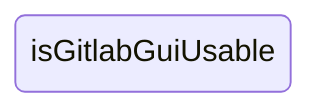
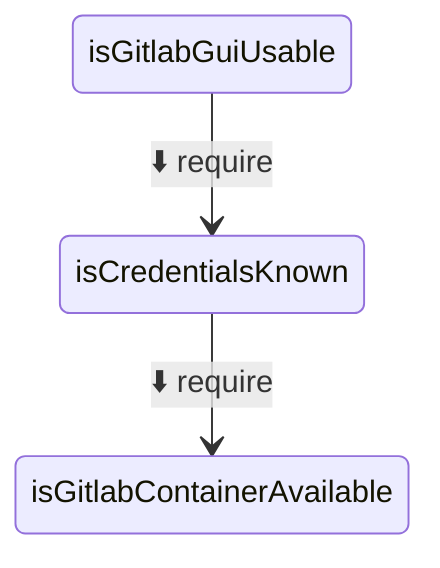
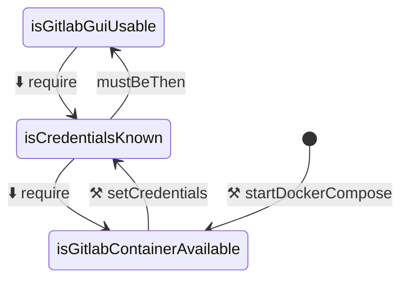
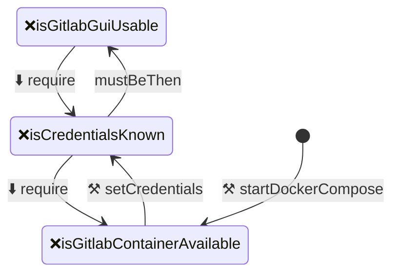
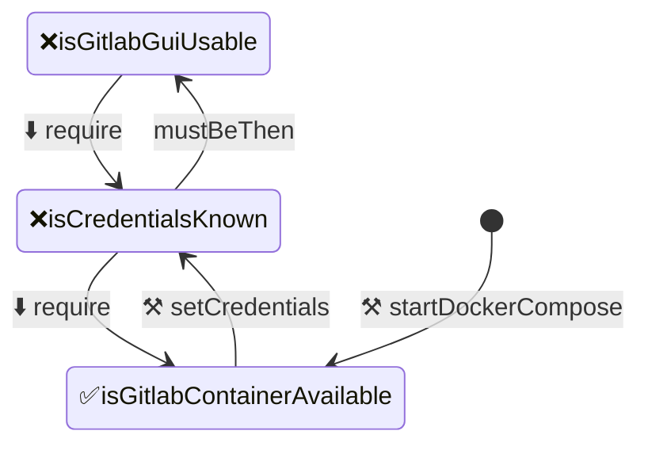
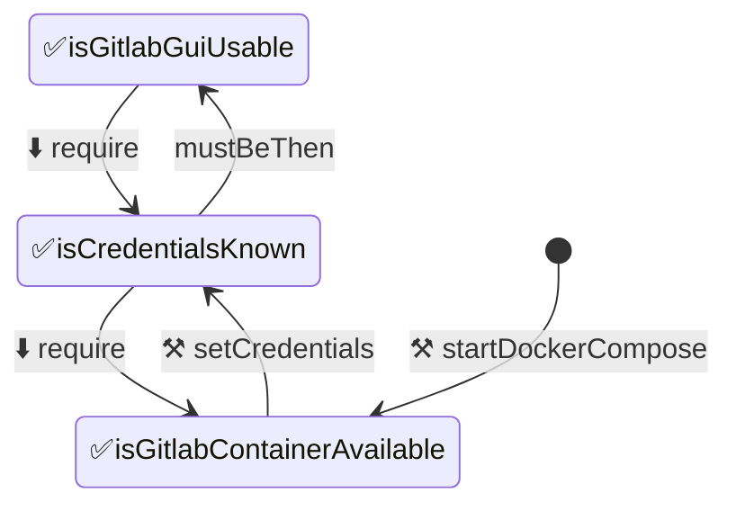

# Testable Contract Graph. Simple What and How To.

This is a tool for defining requirements, the dependencies between them, and the verifications needed to confirm each requirement is satisfied.

_Start with the goal → work backward to understand dependencies → create tasks from the bottom up → define verification → ( verify → do the task → )_

```code
src
├─ contract-testable-graph
│  ├─ contractGraph.md
│  ├─ contractGraph-verified.md
│  └─ verifications
│     ├─ verification1.sh
│     ├─ verification2.sh
│     └─ verification3.sh
├─ …
```

### Step #1: Start with the goal:



### Step #2: Work backward to understand dependencies:



### Step #3: Create tasks from the bottom up



### Step #4: Define verification

#### 1. Verification #1 (auto):

```bash
#!/bin/bash

set -e

echo ""
echo " file: isGitlabContainerAvailable.sh"
echo " description: Verifying if the GitLab container is available."
echo ""

VALUE="$(curl -s -o /dev/null -w '%{http_code}' http://gitlab:8080)"

if [ "$VALUE" = "302" ]; then
    echo "✅ [tty] verification passed: GitLab container is available"
    exit 0
else
    echo "❌ [tty] verification failed: GitLab container is not available"
    exit 1
fi
```

#### 2. Verification #2 (manual):

```bash
#!/bin/bash

set -e

echo ""
echo " file: isCredentialsKnown.sh"
echo " description: Verifying if valid credentials are available."
echo ""
echo " Please run the following command(s) in another terminal:"
echo " 1. docker exec -it gitlab /opt/gitlab/bin/gitlab-rails runner \"u = User.find_by(username: 'root'); u.password = 'AnotherPassword'; u.password_confirmation = 'AnotherPassword'; u.save!\""
echo ""
echo "Send OK if login succeeded, press ENTER if login failed."
read VALUE

if [ -n "$VALUE" ]; then
    echo "✅ [tty] verification passed: GitLab GUI password is determined"
    exit 0
else
    echo "❌ [tty] verification failed: GitLab GUI password is not determined"
    exit 1
fi
```

#### 3. Verification #3 (manual):

```bash
#!/bin/bash

set -e

echo ""
echo " file: isGitlabGuiUsable.sh"
echo " description: Verifying if the GitLab GUI is usable."
echo ""
echo " Please perform the following in another terminal:"
echo " 1. Go to http://gitlab:8080/ and log in with the new credentials."
echo ""
echo "Send OK if login succeeded, press ENTER if login failed."
read VALUE

if [ -n "$VALUE" ]; then
    echo "✅ [tty] verification passed: GitLab GUI is usable"
    exit 0
else
    echo "❌ [tty] verification failed: GitLab GUI is not usable"
    exit 1
fi
```

### Step #5: Verify

```terminal
node ./verify.js \
 --contractGraph ./contractGraph.md \
 --verifications ./verifications
```



### Step #6: Do the task

-  [x] Start Docker Compose

### Step #7: Verify



### Step #8 (6): Do the task

-  [x] Set credentials
### Step #9 (7): Verify



---
