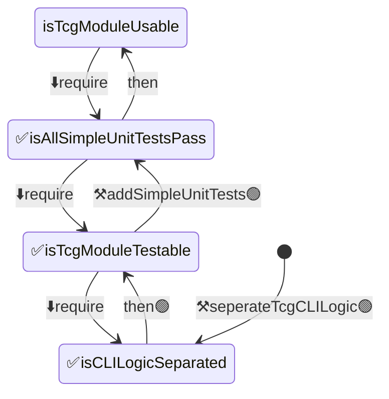

```mermaid
    stateDiagram-v2

    isTcgModuleUsable --> ✅isAllSimpleUnitTestsPass: ⬇️require
    ✅isAllSimpleUnitTestsPass --> isTcgModuleUsable: then

    ✅isAllSimpleUnitTestsPass --> ✅isTcgModuleTestable: ⬇️require
    ✅isTcgModuleTestable --> ✅isAllSimpleUnitTestsPass: ⚒️addSimpleUnitTests🟢
    %% added: 27.11.25T10:25
    %% started: 27.11.25T10:40
    %% finished: 28.11.25T08:40


    ✅isTcgModuleTestable --> ✅isCLILogicSeparated : ⬇️require
    ✅isCLILogicSeparated --> ✅isTcgModuleTestable : then🟢

    [*] --> ✅isCLILogicSeparated: ⚒️seperateTcgCLILogic🟢
    %% added: 27.11.25T10:27
    %% started: 27.11.25T10:27
    %% finished: 27.11.25T10:32

    
```