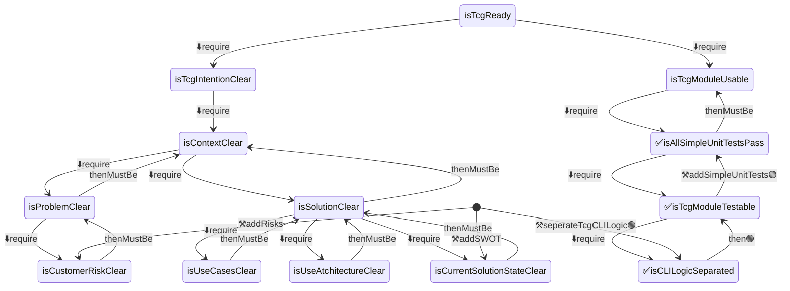

```mermaid
    stateDiagram-v2

    isTcgReady --> isTcgIntentionClear: ⬇️require
    isTcgReady --> isTcgModuleUsable: ⬇️require

    isTcgIntentionClear --> isContextClear: ⬇️require
    isContextClear --> isProblemClear: ⬇️require
    isProblemClear --> isContextClear: thenMustBe
    
    isProblemClear --> isCustomerRiskClear: ⬇️require
    isCustomerRiskClear --> isProblemClear: thenMustBe
    
    isContextClear --> isSolutionClear: ⬇️require
    isSolutionClear --> isContextClear: thenMustBe

    isSolutionClear --> isUseCasesClear: ⬇️require
    isUseCasesClear --> isSolutionClear: thenMustBe

    isSolutionClear --> isUseAtchitectureClear: ⬇️require
    isUseAtchitectureClear --> isSolutionClear: thenMustBe

    isSolutionClear --> isCurrentSolutionStateClear: ⬇️require
    isCurrentSolutionStateClear --> isSolutionClear: thenMustBe
    [*] --> isCurrentSolutionStateClear: ⚒️addSWOT

    isTcgModuleUsable --> ✅isAllSimpleUnitTestsPass: ⬇️require
    ✅isAllSimpleUnitTestsPass --> isTcgModuleUsable: thenMustBe

    ✅isAllSimpleUnitTestsPass --> ✅isTcgModuleTestable: ⬇️require
    ✅isTcgModuleTestable --> ✅isAllSimpleUnitTestsPass: ⚒️addSimpleUnitTests🟢
    %% added: 27.11.25T10:25
    %% started: 27.11.25T10:40
    %% finished: 28.11.25T08:40


    ✅isTcgModuleTestable --> ✅isCLILogicSeparated : ⬇️require
    ✅isCLILogicSeparated --> ✅isTcgModuleTestable : then🟢

    [*] --> ✅isCLILogicSeparated: ⚒️seperateTcgCLILogic🟢
    %% added: 27.11.25T10:27
    %% started: 27.11.25T10:27
    %% finished: 27.11.25T10:32

    [*] --> isCustomerRiskClear: ⚒️addRisks

    %% [*] --> isVoiceOfCustomerClear: ⚒️addRisks
    
```