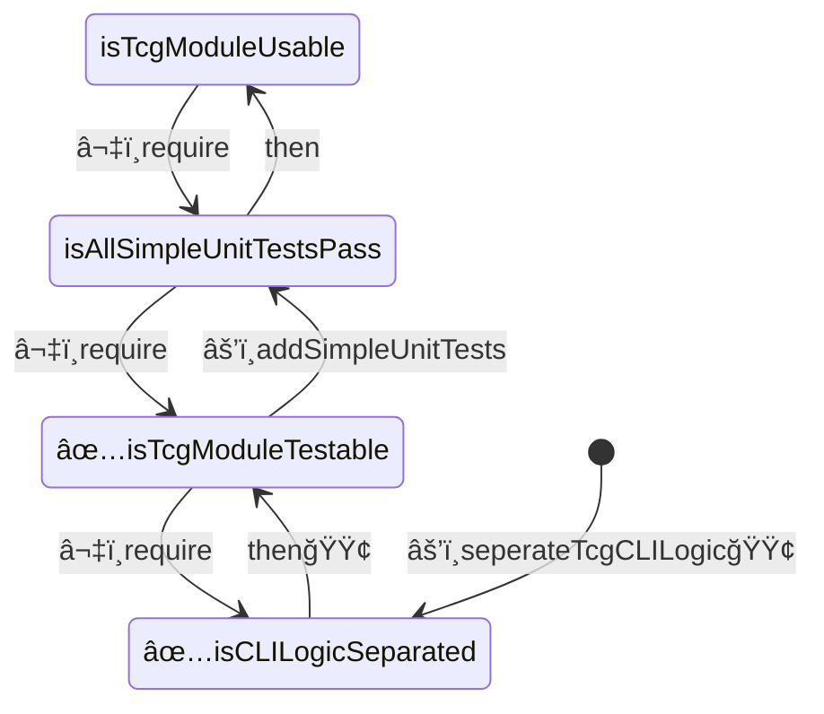

```mermaid
    stateDiagram-v2

    isTcgModuleUsable --> isAllSimpleUnitTestsPass: ⬇ï¸require
    isAllSimpleUnitTestsPass --> isTcgModuleUsable: then

    isAllSimpleUnitTestsPass --> ✅isTcgModuleTestable: ⬇ï¸require
    ✅isTcgModuleTestable --> isAllSimpleUnitTestsPass: âš’ï¸addSimpleUnitTests
    %% added: 27.11.25T10:25
    %% started: -
    %% finished: -


    ✅isTcgModuleTestable --> ✅isCLILogicSeparated : ⬇ï¸require
    ✅isCLILogicSeparated --> ✅isTcgModuleTestable : then🟢

    [*] --> ✅isCLILogicSeparated: âš’ï¸seperateTcgCLILogic🟢
    %% added: 27.11.25T10:27
    %% started: 27.11.25T10:27
    %% finished: 27.11.25T10:32

    
```