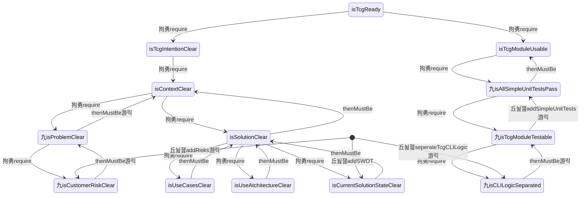

```mermaid
    stateDiagram-v2

    isTcgReady --> isTcgIntentionClear: 拘勇require
    isTcgReady --> isTcgModuleUsable: 拘勇require

    isTcgIntentionClear --> isContextClear: 拘勇require
    isContextClear --> 九isProblemClear: 拘勇require
    九isProblemClear --> isContextClear: thenMustBe游릭
    
    九isProblemClear --> 九isCustomerRiskClear: 拘勇require
    九isCustomerRiskClear --> 九isProblemClear: thenMustBe游릭
    
    isContextClear --> isSolutionClear: 拘勇require
    isSolutionClear --> isContextClear: thenMustBe

    isSolutionClear --> isUseCasesClear: 拘勇require
    isUseCasesClear --> isSolutionClear: thenMustBe

    isSolutionClear --> isUseAtchitectureClear: 拘勇require
    isUseAtchitectureClear --> isSolutionClear: thenMustBe

    isSolutionClear --> isCurrentSolutionStateClear: 拘勇require
    isCurrentSolutionStateClear --> isSolutionClear: thenMustBe
    [*] --> isCurrentSolutionStateClear: 丘뉦잺addSWOT

    isTcgModuleUsable --> 九isAllSimpleUnitTestsPass: 拘勇require
    九isAllSimpleUnitTestsPass --> isTcgModuleUsable: thenMustBe

    九isAllSimpleUnitTestsPass --> 九isTcgModuleTestable: 拘勇require
    九isTcgModuleTestable --> 九isAllSimpleUnitTestsPass: 丘뉦잺addSimpleUnitTests游릭
    %% added: 27.11.25T10:25
    %% started: 27.11.25T10:40
    %% finished: 28.11.25T08:40


    九isTcgModuleTestable --> 九isCLILogicSeparated : 拘勇require
    九isCLILogicSeparated --> 九isTcgModuleTestable : thenMustBe游릭

    [*] --> 九isCLILogicSeparated: 丘뉦잺seperateTcgCLILogic游릭
    %% added: 27.11.25T10:27
    %% started: 27.11.25T10:27
    %% finished: 27.11.25T10:32

    [*] --> 九isCustomerRiskClear: 丘뉦잺addRisks游릭
    %% added: 28.11.25T10:30
    %% started: 28.11.25T10:30
    %% finished: 28.11.25T11:05
    
```