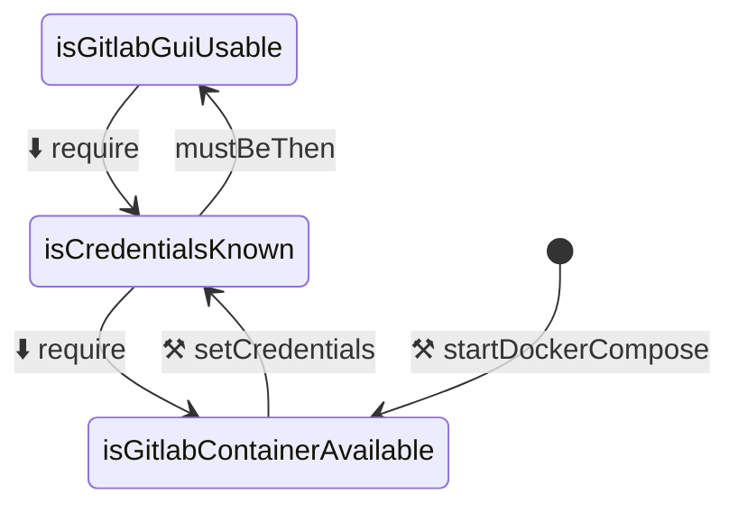

```mermaid
stateDiagram-v2
    isGitlabGuiUsable --> isCredentialsKnown: ⬇️ require
    isCredentialsKnown --> isGitlabGuiUsable: mustBeThen
    isCredentialsKnown --> isGitlabContainerAvailable: ⬇️ require
    isGitlabContainerAvailable --> isCredentialsKnown: ⚒️ setCredentials
    [*] --> isGitlabContainerAvailable: ⚒️ startDockerCompose
```